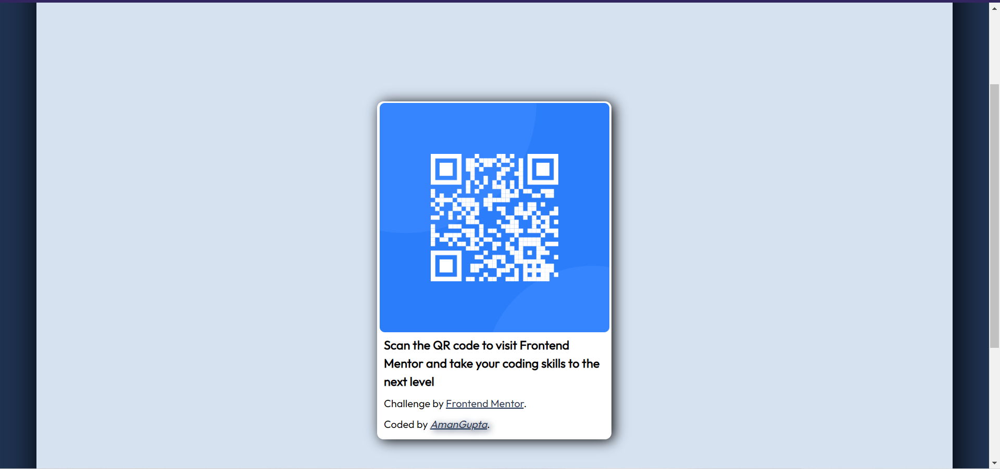

# Frontend Mentor - QR code component solution

This is a solution to the [QR code component challenge on Frontend Mentor](https://www.frontendmentor.io/challenges/qr-code-component-iux_sIO_H). Frontend Mentor challenges help you improve your coding skills by building realistic projects. 

## Table of contents
  - [Screenshot](#screenshot)
  - [Links](#links)
  - [Built with](#built-with)
  - [What I learned](#what-i-learned)
  - [Continued development](#continued-development)
  - [Useful resources](#useful-resources)
  - [Author](#author)

### Screenshot

### Links

- Live Site URL: (https://amangupta1703.github.io/QR-Code/)

### Built with

- Semantic HTML5 markup
- CSS custom properties
- Flexbox

### Continued development

I want to focus on concepts such as flexbox, css grid and measurement units.

### Useful resources

- (https://www.w3schools.com/) - This website helped me in html and css syntax element.This is an amazing document for beginners.

- (https://developer.mozilla.org/en-US/docs/Learn/HTML) - This is an official document and the concepts are explained in a good way.

## Author

- Website - https://amangupta1703.github.io/QR-Code/
